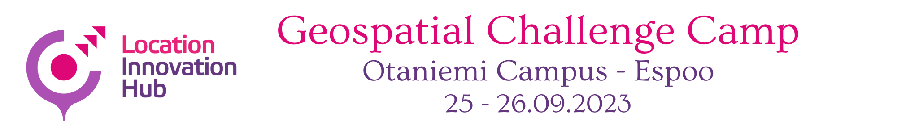

Geospatial Challenge Camp Finland
=================================

**Geospatial Challenge Camp** is a 10-weeks long challenge-based course that aims to provide **young researchers** (doctoral and post-doctoral researchers, MSc students)
a chance to tackle relevant real-world challenges in cross-disciplinary teams. The participants from Finnish universities and research organisations will work in multidisciplinary teams
to identify and analyse complex location and time -related societal problems. The teams will co-design and build digital impact-driven solutions, which would improve the current know-how and
capabilities of managing these problems in the society. Researcher teams work actively with their peers, mentors and stakeholders during the camp and focus on designing geospatial data and digital technology solutions,
which could have sustainability impacts for the users of the solution and for the society at large.

**The theme** for the Geospatial Challenge Camp for year 2023 is **Health and wellbeing**. Good health is essential to sustainable development and the 2030 Agenda reflects the complexity and interconnectedness of the two.
In the challenge, the objective is to work towards integrating health and location data to support analysis and improvement of health and wellbeing. Possible application areas include air quality, climate change effects in
urban planning, pandemic management, widening economic and social inequalities, and rapid urbanisation.

Background
----------

Geospatial Challenge Camp is a new skills development and innovation service of Geoportti Research Infrastructure (https://www.geoportti.fi/) and Location Innovation Hub (LIH), which is one of the European Digital Innovation Hubs.
The goal of the Camp is to facilitate the growth of open data, technology and application innovations around Finnish research expertise and strengthen Finnish geospatial competence and innovation ecosystem through cross-fertilization of research,
innovation, business and sustainable development expertise around digital location data and technologies. The Geospatial Challenge Camp aims to link scientists from various disciplines to work on real-world sustainability challenges posed by societal actors,
data providers, companies, NGOs and innovation community actors. The challenge camp will facilitate the professional growth of young scientists and practitioners regarding the use of data, technology and application innovations stemming from the Finnish geospatial research expertise.
Challenges will offer researchers a chance to expand their data science solutions into new operative solutions and make a broader societal impact in Finland and beyond.

How is the camp organized?
--------------------------

The camp is 10 weeks long and equals 5 university credits (100-140 hours of work). Groups are formed from young researchers representing different universities, research organisations, disciplines and skills,
and they will work on real challenges and problems identified and confronted by different actors in the society. At the beginning of the camp, the groups will work together with these actors to define a more
detailed problem, which their group will try to solve. All solutions developed during the camp use and apply geospatial data and digital technologies. The groups will work independently to solve the problem and
finally present their solutions.

Schedule and programme
----------------------

The first Geospatial Challenge Camp will run from Mid-March to mid-May in 2023. The camp will be started with a 2-day kick-off (March 14-15th) held in Helsinki Metropolitan Area (Hosted at Aalto University) and the
results will be presented in the 2023 Geoinformatics Research Days in Helsinki (May 16th).

The tentative programme for the course is as follows:

.. list-table::
    :widths: 2 6
    :header-rows: 1
    :stub-columns: 1
    :align: left

    * - Time
      - Content

    * - Week 1
      - - Challenge introduction phase
        - March 14-15th: **Kick-off meeting**

    * - Week 2
      - - Challenge specification phase

    * - Weeks 3-5
      - - Prototyping/ideation
        - April 18th: **Mid-term seminar**

    * - Weeks 6-9
      - - Solution building

    * - Week 10
      - - Finalization and final seminar

Contents
--------

.. toctree::
   :maxdepth: 1
   :caption: Basic information
   :titlesonly:
   :hidden:

   course-info/introduction

