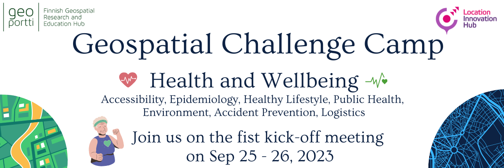

What is it?
------------

A 10-weeks long challenge-based course to tackle relevant **Health and Wellbeing** real-world challenges in cross-disciplinary teams.

What is the aim?
-----------------

To design and build digital impact-driven solutions for complex location and time-related societal problems focused on the improvement 
**Health and Wellbeing**

To whom is it for?
------------------
Doctoral/Post-Doctoral Researchers and Master students

General information
--------------------

The *Geospatial Challenge Camp* is a new skills development and innovation service of `Geoportti Research Infrastructure <https://www.geoportti.fi/>`_ 
and `Location Innovation Hub (LIH) <https://www.maanmittauslaitos.fi/en/locationinnovationhub>`_, which is one of the European Digital Innovation Hubs. 
The Geospatial Challenge Camp is a 10-week long challenge-based course (5 ECTS) that aims to provide participants a chance to tackle relevant 
real-world challenges in cross-disciplinary teams. The participants are doctoral and post-doctoral researchers plus master students 
from Finnish universities and research organizations. They will work together in multidisciplinary teams and 
collaborate with mentors and stakeholders.

The aims of the course:

- Identify and analyze complex location and time-related societal problems
- Design and build digital impact-driven solutions, which would improve the current know-how and capabilities of managing these problems in the society
- Link scientists from various disciplines to work on real-world sustainability challenges posed by societal actors, data providers, companies, NGOs and innovation community actors
- Facilitate the professional growth of young scientists and practitioners regarding the use of data, technology and application innovations stemming from the Finnish geospatial research expertise
- Offer researchers a chance to expand their data science solutions into new operative solutions and make a broader societal impact in Finland and beyond

The theme for the Geospatial Challenge Camp for year 2023 is **Health and Wellbeing**. In the challenge, 
the objective is to work towards integrating health and location data to support analysis and improvement 
of health and wellbeing. Possible application areas include:

- Air quality
- Climate change effects in urban planning
- Pandemic management
- Economic and societal inequalities
- Rapid urbanization

The benefits of the Geospatial Challange Camp:

- Facilitate the growth of open data, technology and application innovations around Finnish research expertise
- Strengthen Finnish geospatial competence and innovation ecosystem through cross-fertilization of research, innovation, business and sustainable development expertise around digital location data and technologies

Sign Up 
--------

.. raw:: html

    

        

            

                

                
                

                    <h5 class="card-title">Researchers and Students</h5>
                    
Find information about signing up and important dates in the dedicated site to Researchers and Master students

.. container:: custom-button

    `Participants site <sites/participants.html>`_

.. raw:: html

                

                

            

            

                

                
                

                    <h5 class="card-title">Partners</h5>
                    
Find information about confirmation and important dates in the dedicated site to Partners

.. container:: custom-button

    `Partners site <sites/partners.html>`__

.. raw:: html

                  

                

            

        

    

Schedule
-------------------

The course runs for 10 weeks with a following structure:

.. list-table::
    :widths: 2 9
    :header-rows: 1
    :stub-columns: 1
    :align: left

    * - Time
      - Content
    
    * - Kick-off event
      - - 25.-26.9.2023 at Aalto University, Espoo
        - Introduction to the challenge theme, meeting with stakeholders, forming teams
        - A half day public seminar will be held first on Sep 25th with all the collaborators and researchers and Geoportti RI and LIH experts
        - A day and a half workshop with the researchers and Geoportti RI mentors (UTU, Aalto, FGI, SCS, SYKE, EUF) will follow
        
    * - Week 1
      - - Getting to know the societal context of the challenge, core data and tech options, Sustainable Development Goals relevance and linkages, etc
        - Communicating with teams

    * - Week 2
      - - Challenge specification phase
        - Analyzing the broad challenge, learning insights, getting familiar with data and tools, etc
        - Specification of the team's problem/sub-challenge
        - Gathering resources, specifying stakeholders
        - At the end of this phase the teams have planned what they will be doing for the rest of the course and can proceed in their project

    * - Weeks 3-5
      - - Prototyping and rapid ideation of solutions
        - Testing data and tools
        - Validating ideas with stakeholders
        - At the end of this phase the teams know how they will solve the problem, will be able to present their approach to other students on the course and external stakeholders, and can start to develop the complete solution

    * - Mid-term Seminar
      - - November 1st, 2023
        - Each group presents their own project and prototyping/ideas in a physical meeting held either in Helsinki or Turku (to be confirmed). Full day seminar and feedback session with key mentors present
        - Discussions of the groups' work and a chance to see others group's work
        - Here each group needs to be far enough in their work that they can give a presentation on how they will solve the problem

    * - Weeks 6-9
      - - Team working to make a solution prototype 
        - Mentoring sessions

    * - Week 10
      - - Finalization and final seminar
        - Each group will present their solution to the rest of the course, stakeholders, and general audience during the Geoinformatics Research Days 2024
        - Any data, software demos etc. created will also be publicly distributed (unless otherwise agreed by the group, the stakeholders and the course staff)
        - Follow-up plans will also be presented, in order for the work to continued among interested parties

    * - Final Seminar
      - - 5.12.2023 in Turku or Espoo
        - Each group will present their solution to the rest of the course, stakeholders, and general audience
        - Any data, software demos etc. created will also be publicly distributed (unless otherwise agreed by the group, the stakeholders and the course staff)
        - Follow-up plans will also be presented, in order for the work to continued among interested parties

