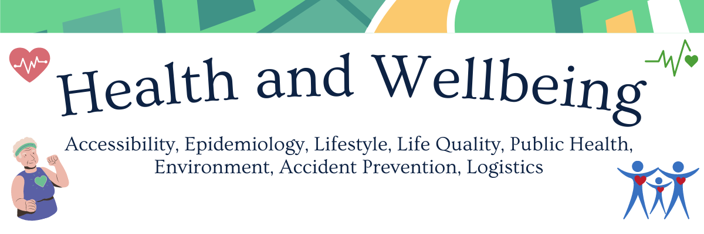

.. figure:: _static/banner_logos.png

Why Geospatial Challenge Camp?
================================

Geospatial Challenge Camp aims at engaging young scientists and students 
to solve real-world sustainability challenges with digital data and 
location technologies. In 2023, the topic of the challenge is 
health and wellbeing.

When?
======

Starting on September 25-26th, 2023 with a kick-off event and 
closing on December 1st, 2023. Multi-disciplinary teams of 
young scientists work in close collaboration with different 
stakeholders to co-create digital and social innovations 
related to our health and wellbeing challenges

How to cooperate with us and sign-up for the challenge?
=========================================================

Researchers and students, check below how to sign-up for the Geospatial Challenge Camp to boost your digital data and innovations skills and enlarge your networks.
Collaborators, read more on how to be involved and match your digital health and well-being information needs and opportunities with us.

How to participate
===================

Register your participation as your suitable role in the course.

.. raw:: html

    

        

            

                

                  
                    

                      <h5 class="card-title">Researchers and Students</h5>
                        
Read more about the aims, important dates and registration of the Challenge Camp 2023

.. container:: custom-button

    `Sign Up <sites/participants.html>`_

.. raw:: html

                    

              

            

          

              

              
              

                  <h5 class="card-title">Partners and Institutions</h5>
                  
Read more on how to work with us and how to sign-up as a partner. No costs, just great opportunities for you!

.. container:: custom-button

    `Sign Up <sites/partners.html>`__

.. raw:: html

                

                

            

        

    

Challenge Camp 2023 
=====================

The *Geospatial Challenge Camp* is a new skills development and innovation 
service of `Geoportti Research Infrastructure <https://www.geoportti.fi/>`_ 
and `Location Innovation Hub (LIH) <https://www.maanmittauslaitos.fi/en/locationinnovationhub>`_, 
which is one of the European Digital Innovation Hubs. 
The Geospatial Challenge Camp is a 10-week long challenge-based course (5 ECTS) 
that aims to provide participants a chance to tackle relevant 
real-world challenges in cross-disciplinary teams. 
The participants are doctoral and post-doctoral researchers plus master students 
from Finnish universities and research organizations. 
They will work together in multidisciplinary teams and 
collaborate with mentors and stakeholders.

The course aims to identify and analyze complex location and 
time-related societal problems that requires the designing 
and building of digital impact-driven solutions, scientists from 
various disciplines will work together on real-world sustainable solutions.
Participants will benefit their professional growth regarding the use of data, 
technology, and application innovations stemming from the Geoportti project.

The challenges will be posed by societal actors, data providers, companies, 
NGOs and innovation community actors and they will offer to Researchers the 
chance to expand their data science solutions into new operative solutions 
and make a broader societal impact in Finland and beyond.

Theme 
==========

The challenge is to work towards integrating health and location data 
to support analysis and improvement of health and wellbeing. 
Possible application areas include:

- **Accessibility**

  Are the health services well distributed in space for the access of citizens?

- **Epidemiology**

  How to avoid massive spatial spread of diseases?

- **Lifestyle**

  What are the most healthy habits that the city can provide to the lifestyle?

- **Life Quality**

  How good is the satisfaction of citizens in relation to their health?

- **Public Health**

  How well planned is the public health for citizens in a rapid urbanization?

- **Environment**

  How the pollution is affecting the health of citizens and how we can decrease it?

- **Accident Prevention**

  How to measure and prevent the accidents that affects health and wellbeing?

- **Logistics**

  Are medical resources well distributed?

.. toctree::
   :maxdepth: 2
   :hidden:
   :caption: Sign Up

   sites/partners
   sites/participants
   sites/schedule
   
  

