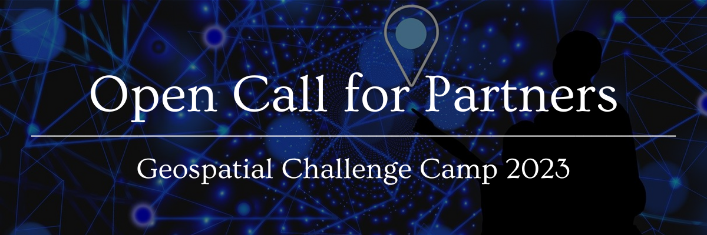

Partners
==========

Is your organization looking for a solution? The Geospatial Challenge Camp 2023 
aims to solve real-world sustainable challenges of **Health and Wellbeing** with 
open data and location technologies. Join us and collaborate with us 
to work together with multidisciplinary team in this 10-week course 
during September-December 2023.

👉 `Sign up in this Form <https://forms.gle/Emo8MP8SNZfvcxqJ8>`_ 
--------------------------------------------------------

.. admonition:: Deadline

    Register as Partner before the **15.08.2023**

Partner activities
====================
As a Partner you can support the Geospatial Challenge Camp in the next activities:

Challenge theme owners
-----------------------
Does your organization have real-world health and wellbeing problems? 
Is your team willing to solve those problems with open data and location technologies?

Digital data providers
-----------------------
Does your organization have digital health related location data?
Would you offer this data to multidisciplinary teams for exploration and innovation?

Policy maker
-------------
Do you have health related information gaps for the improvement of decision making?
Are you willing to find the link between data-driven solutions to public health policy making?

Financial sponsors
-------------------
Is yor organization interested in supporting the challenge camp and provide scholarships 
to young scientists? Or perhaps an award for the best solution?

Possible partners
===================

- Health care and wellbeing organizations and institutes
- Wellbeing services counties
- Organizations providing location and statistical information
- Health and wellbeing companies
- Companies interested in extending their activities to health and wellbeing domain
- Innovation hubs and actors
- Cities, municipalities, provinces
- Enthusiastic volunteers

We offer
=========

1. New digital solutions to real-world health and well-being problems
2. Working with young talented researchers and novel data processing
3. Refined and new digital high-value data sets
4. Stronger professional networks with location and tech experts

For more information
======================
Download:

- `Which flyer? <>`_ 
- `Presentation? <>`_ 

Contact us
============
Do you have questions? Do you want to talk with us? Send an email to geospatial-challenge@utu.fi

